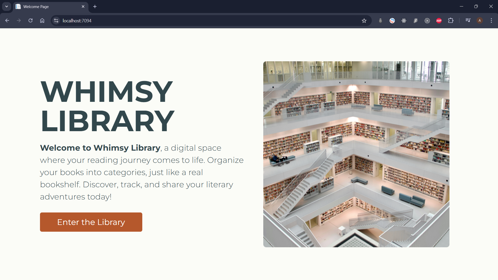
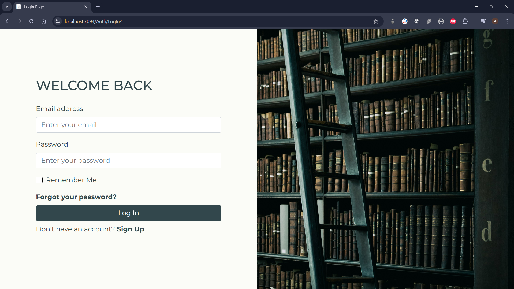
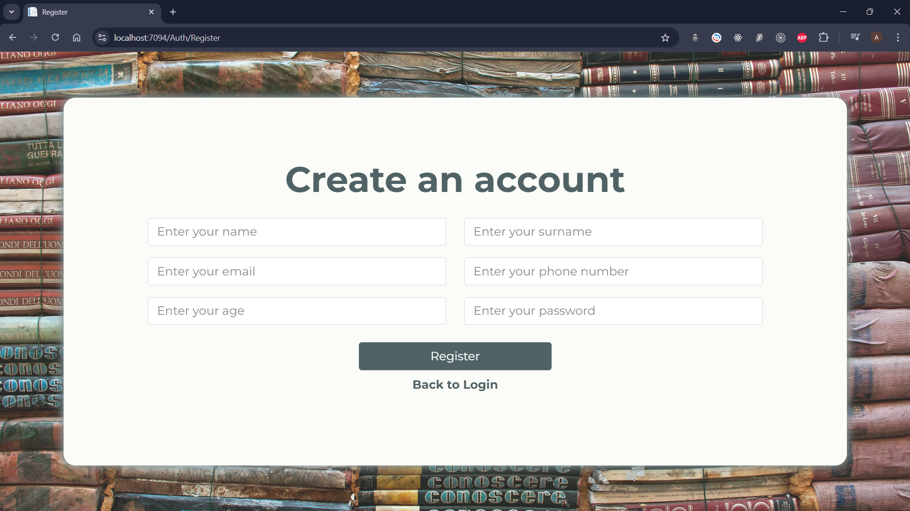
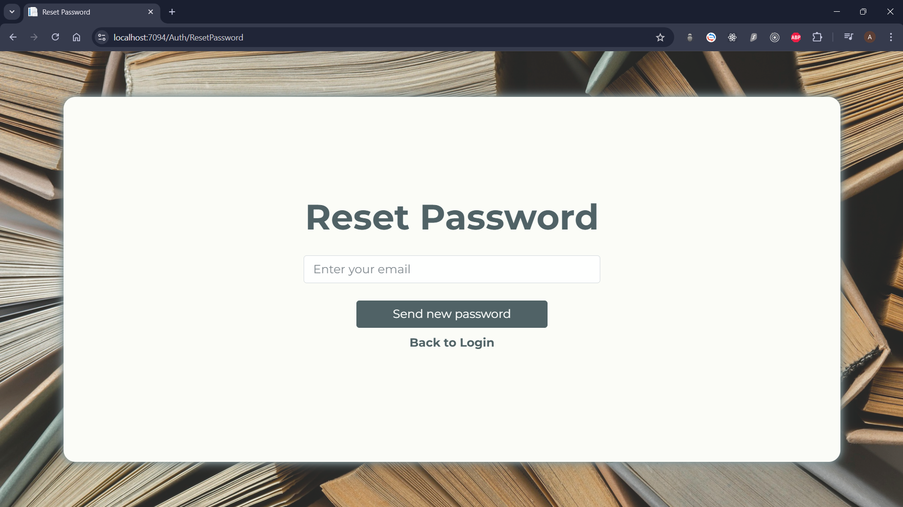
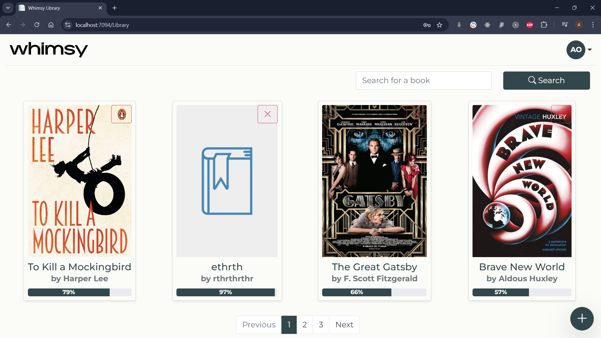
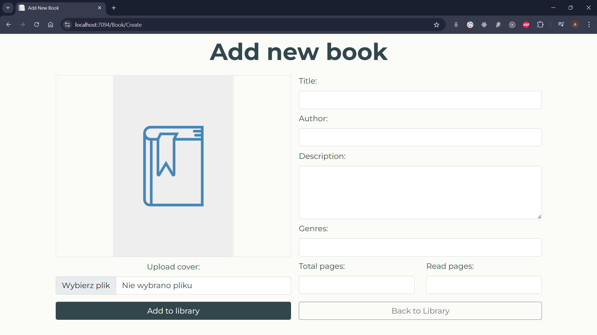
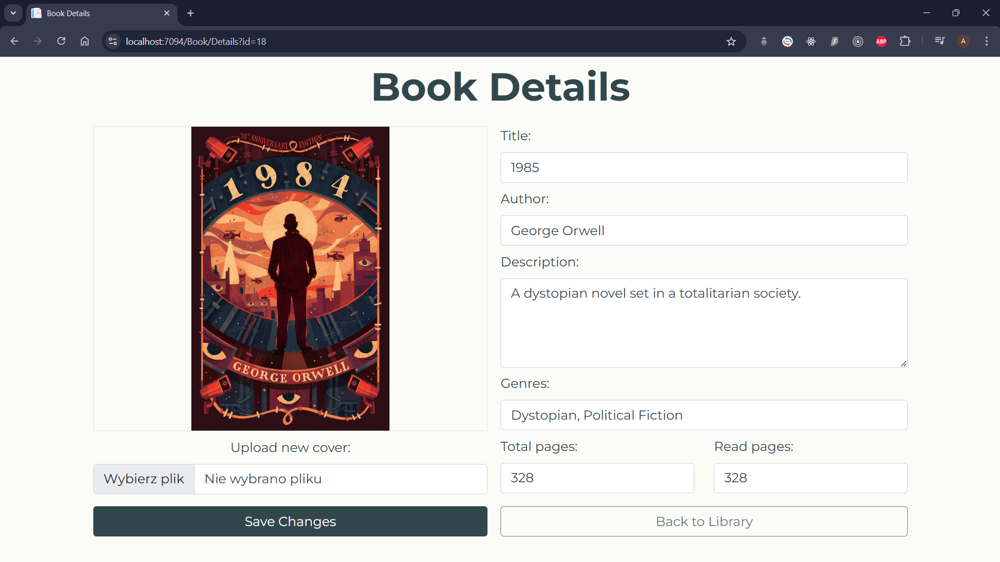
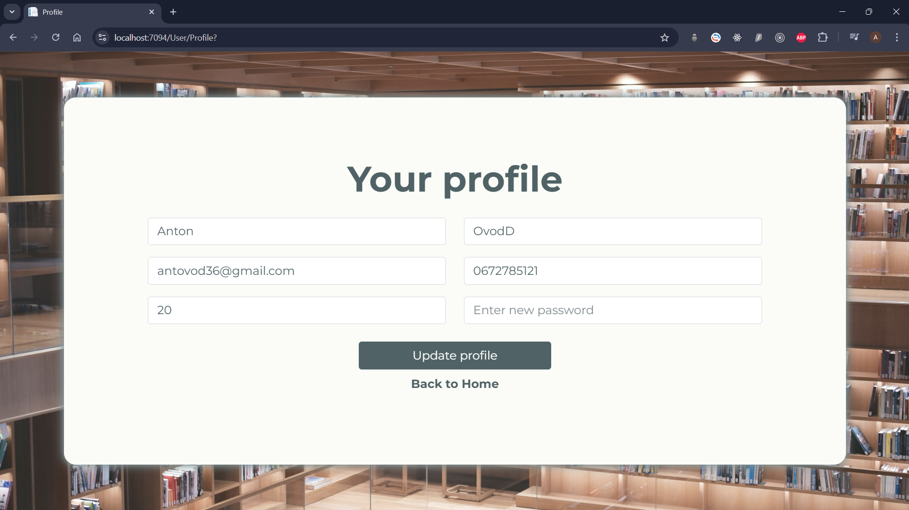
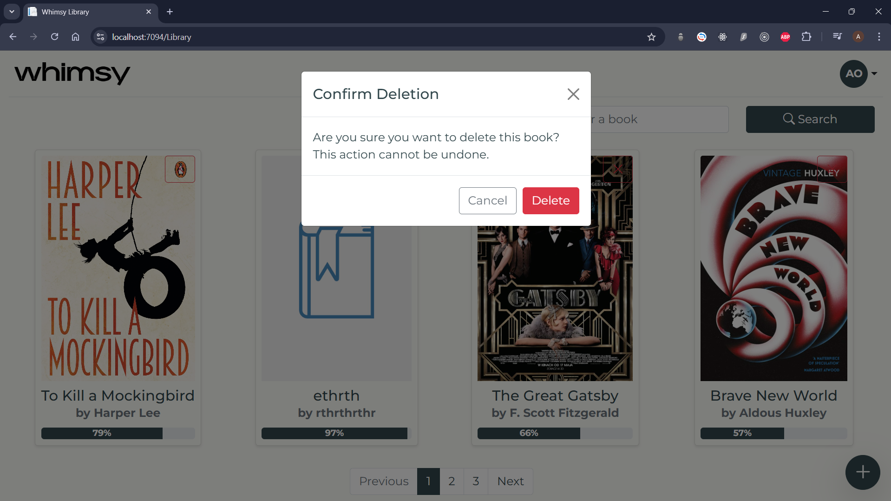
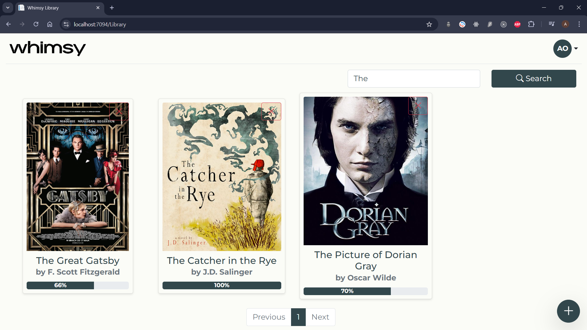

# Whimsy Library - Online Biblioteka  

## Autor  
**Imię i nazwisko:** Anton Ovod  
**Grupa laboratoryjna:** IO 5.3  

[Читати українською](./README-UA.md) | [Read in English](./README.md)

---

## Opis projektu  
Whimsy Library to nowoczesna aplikacja internetowa służąca jako osobista biblioteka online. 
Umożliwia użytkownikom zarządzanie ich kolekcją książek w sposób wygodny i intuicyjny. 
Projekt powstał z myślą o entuzjastach literatury, którzy pragną mieć pełną kontrolę nad swoimi zbiorami książkowymi w jednym miejscu.  

Aplikacja zapewnia przyjazny interfejs, zaawansowaną funkcjonalność oraz 
stabilność działania dzięki wykorzystaniu nowoczesnych technologii webowych i 
najlepszych praktyk programistycznych.

---

## Funkcjonalności  

1. **Rejestracja i logowanie użytkowników:**  
   - Użytkownicy mogą założyć konto w aplikacji, podając niezbędne dane.  
   - Po rejestracji, użytkownik ma możliwość zalogowania się na swoje konto za pomocą e-mail oraz hasła.  

2. **Resetowanie hasła:**  
   - W przypadku zapomnienia hasła, aplikacja umożliwia łatwy proces jego odzyskiwania.  
   - Mechanizm resetowania hasła opiera się na wysyłaniu e-maila z hasłem tymczasowym.

3. **Zarządzanie książkami:**  
   - Użytkownicy mogą dodawać książki do swojej biblioteki, podając szczegółowe informacje oraz opcjonalnie okładkę.  
   - Możliwość edytowania szczegółów książek zapewnia użytkownikom elastyczność i łatwą aktualizację danych.  
   - Książki mogą być usuwane z biblioteki, jeśli użytkownik zdecyduje się je wycofać.  

4. **Wyszukiwanie książek:**  
   - Zaawansowana funkcja wyszukiwania umożliwia użytkownikom szybkie znalezienie książki na podstawie jej tytułu.  
   - Mechanizm wyszukiwania działa w czasie rzeczywistym, dostarczając błyskawicznych wyników.  

5. **Zarządzanie danymi użytkownika:**  
   - Każdy użytkownik ma dostęp do swojego profilu, gdzie może przeglądać i edytować dane osobowe oraz hasło.  

6. **Responsywny interfejs użytkownika:**  
   - Aplikacja została zaprojektowana z myślą o urządzeniach mobilnych i desktopowych, dzięki czemu zapewnia wygodne korzystanie niezależnie od rozmiaru ekranu.  

---

## Wykorzystane technologie  

- **C#** - Język programowania używany w celu budowy logiki aplikacji.  
- **ASP.NET Core** - Framework służący do tworzenia aplikacji webowych.  
- **ASP.NET Core Identity** - Mechanizm uwierzytelniania i autoryzacji użytkowników.  
- **Entity Framework Core** - ORM do zarządzania bazą danych.  
- **MS SQL Server** - Baza danych przechowująca informacje o użytkownikach i książkach.  
- **Bootstrap** - Framework CSS do projektowania responsywnych interfejsów użytkownika.  
- **HTML5, CSS, JS** - Technologie frontendowe wykorzystywane do budowy interfejsu aplikacji.  

---

## Najciekawsze elementy wizualne  

### Ekran strony powitalnej

### Ekran logowania użytkownika

### Ekran rejestracji użytkownika  

### Ekran resetowania hasła

### Ekran strony domowej

### Ekran dodawania ksiązki

### Ekran z danymi ksiązki

### Ekran z danymi użytkownika

### Ekran przed usunięciem ksiązki

### Ekran z wyszykiwaniem książek   

---

## Podsumowanie  
Whimsy Library to idealne rozwiązanie dla każdego miłośnika książek, który pragnie lepiej organizować swoje literackie zasoby. Dzięki szerokiemu zakresowi funkcjonalności oraz nowoczesnemu podejściu do projektowania aplikacji, Whimsy Library łączy intuicyjność obsługi z zaawansowanymi technologiami.  