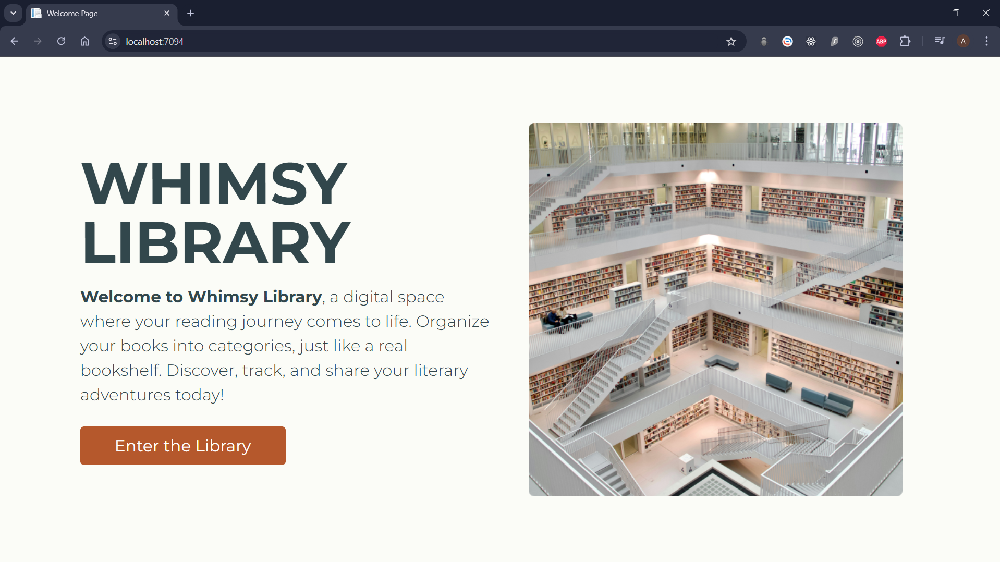
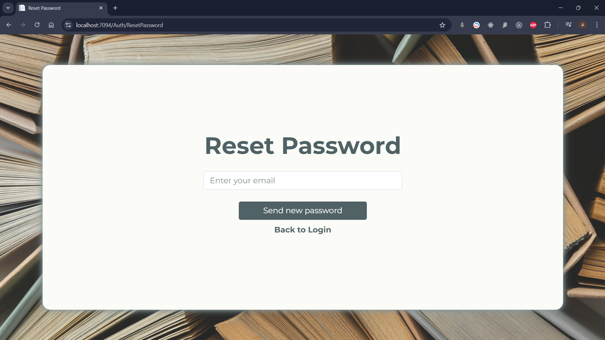
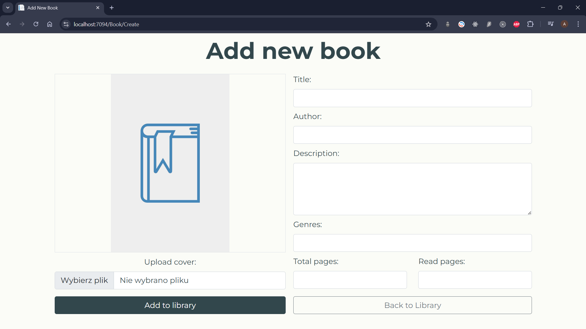

# Whimsy Library - Онлайн бібліотека  

## Автор  
**Ім'я:** Anton Ovod  
**Лабораторна група:** IO 5.3  

[Czytać po polsku](./README-PL.md) | [Read in English](./README.md)

---

## Опис проекту  
Whimsy Library — це сучасний веб-додаток, розроблений як особиста онлайн-бібліотека.  
Він дозволяє користувачам керувати своїми колекціями книг зручно та інтуїтивно.  
Проект створено для книголюбів, які бажають мати повний контроль над своїми книжковими колекціями в одному місці.  

Додаток пропонує зручний інтерфейс, розширений функціонал та стабільність роботи завдяки сучасним веб-технологіям і найкращим програмістським практикам.

---

## Функціонал  

1. **Реєстрація та вхід у систему:**  
   - Користувачі можуть створити обліковий запис, вказавши необхідні дані.  
   - Після реєстрації користувач може увійти в систему за допомогою електронної пошти та пароля.  

2. **Скидання пароля:**  
   - У разі забутого пароля додаток пропонує простий процес відновлення.  
   - Механізм скидання пароля надсилає електронний лист із тимчасовим посиланням для відновлення.  

3. **Управління книгами:**  
   - Користувачі можуть додавати книги до своєї бібліотеки, вказуючи детальну інформацію та за бажанням обкладинку книги.  
   - Можливість редагування деталей книг надає гнучкість та зручність оновлення даних.  
   - Книги можна видаляти з бібліотеки, якщо користувач вирішить їх видалити.  

4. **Пошук книг:**  
   - Розширена функція пошуку дозволяє швидко знайти книги за назвою.  
   - Механізм пошуку працює в режимі реального часу, забезпечуючи миттєві результати.  

5. **Управління даними користувача:**  
   - Кожен користувач має доступ до свого профілю, де може переглядати та редагувати персональні дані й пароль.  

6. **Адаптивний інтерфейс користувача:**  
   - Додаток розроблений для мобільних і настільних пристроїв, забезпечуючи зручність використання незалежно від розміру екрана.  

---

## Використані технології  

- **C#** - Мова програмування, що використовується для побудови логіки додатку.  
- **ASP.NET Core** - Фреймворк для створення веб-додатків.  
- **ASP.NET Core Identity** - Механізм автентифікації та авторизації користувачів.  
- **Entity Framework Core** - ORM для управління базою даних.  
- **MS SQL Server** - База даних для зберігання інформації про користувачів і книги.  
- **Bootstrap** - CSS-фреймворк для створення адаптивного інтерфейсу.  
- **HTML5, CSS, JS** - Технології фронтенду для побудови інтерфейсу додатку.  

---

## Основні візуальні елементи  

### Головна сторінка  

### Сторінка входу  

### Сторінка реєстрації  

### Сторінка скидання пароля  

### Домашня сторінка  

### Сторінка додавання книги  

### Деталі книги  

### Профіль користувача  

### Видалення книги  

### Сторінка пошуку книги  

---

## Підсумок
Whimsy Library — ідеальне рішення для кожного книголюба, який прагне краще організувати свої літературні ресурси. Завдяки широкому спектру функцій та сучасному підходу до дизайну, Whimsy Library поєднує зручність використання з сучасними технологіями.  
