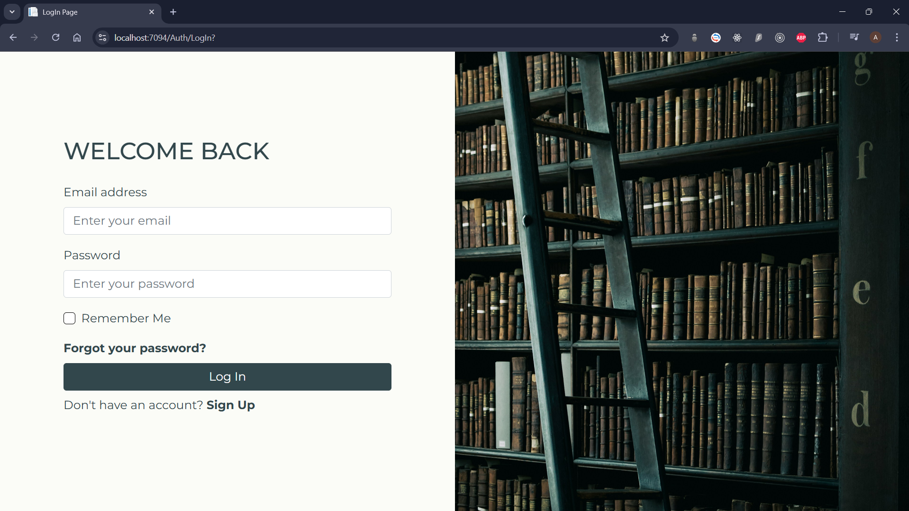
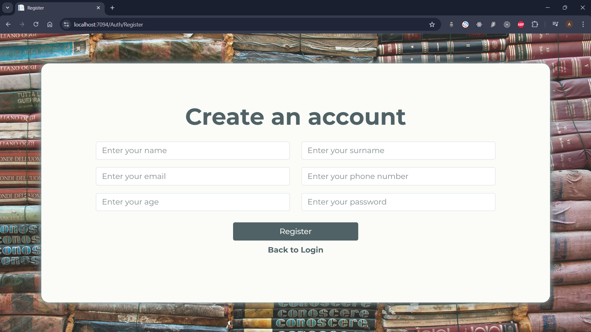
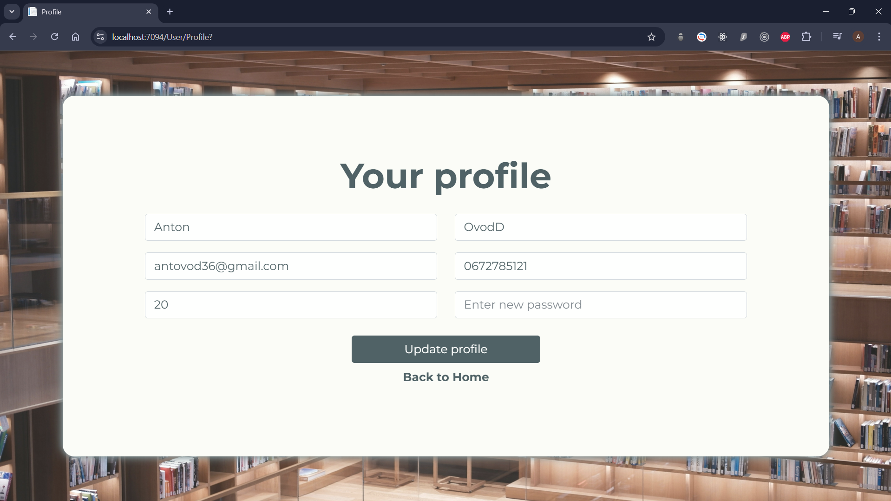

# Whimsy Library - Online Library  

## Author  
**Name:** Anton Ovod  
**Laboratory Group:** IO 5.3  

[Czytać po polsku](./README-PL.md) | [Читати українською](./README-UA.md)

---

## Project Description  
Whimsy Library is a modern web application designed as a personal online library.  
It allows users to manage their book collections conveniently and intuitively.  
The project was created with book enthusiasts in mind, who wish to have full control over their book collections in one place.  

The application offers a user-friendly interface, advanced functionality, and stability, thanks to modern web technologies and best programming practices.

---

## Features  

1. **User Registration and Login:**  
   - Users can create an account by providing necessary data.  
   - After registration, users can log in using their email and password.  

2. **Password Reset:**  
   - If the user forgets their password, the app provides a straightforward recovery process.  
   - The reset mechanism sends an email with a temporary password link.  

3. **Book Management:**  
   - Users can add books to their library by providing detailed information and optionally a book cover.  
   - The app allows editing book details for flexibility and data updates.  
   - Books can be removed from the library if the user decides to delete them.  

4. **Book Search:**  
   - The advanced search feature allows users to find books quickly by title.  
   - The search mechanism works in real-time, providing instant results.  

5. **User Data Management:**  
   - Every user has access to their profile, where they can view and edit personal data and their password.  

6. **Responsive User Interface:**  
   - The application is designed for both mobile and desktop devices, ensuring usability regardless of screen size.  

---

## Technologies Used  

- **C#** - The programming language used to build the application logic.  
- **ASP.NET Core** - Framework for building web applications.  
- **ASP.NET Core Identity** - Authentication and authorization mechanism for users.  
- **Entity Framework Core** - ORM for database management.  
- **MS SQL Server** - Database storing user and book information.  
- **Bootstrap** - CSS framework for designing responsive user interfaces.  
- **HTML5, CSS, JS** - Frontend technologies used to build the application's interface.  

---

## Highlighted Visual Elements  

### Welcome Page  

### Login Page  

### Register Page  

### Password Reset Page  

### Home Page  

### Add Book Page  

### Book Details Page  

### User Profile Page  

### Delete Book Confirmation  

### Search Book Page  

---

## Conclusion  
Whimsy Library is the ideal solution for any book enthusiast who wants to better organize their literary resources. With a wide range of functionalities and a modern approach to app design, Whimsy Library combines usability with advanced technologies.  
